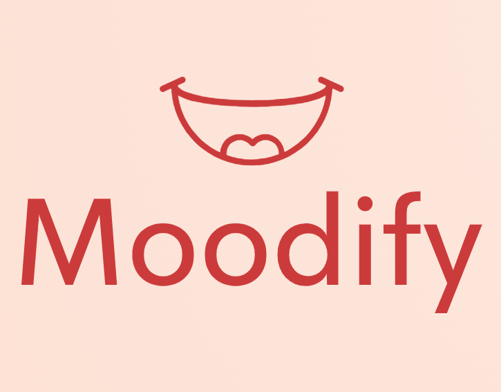

# 🎭 Moodify

<p align="center">
  
</p>

<p align="center">
  <strong>Ruh halinize göre size özel video önerileri sunan mobil uygulama</strong>
</p>

<p align="center">
  <a href="https://flutter.dev">
    
  </a>
  <a href="https://dart.dev">
    
  </a>
  <a href="https://supabase.com">
    
  </a>
  <a href="LICENSE">
    
  </a>
</p>

---

## 📱 Proje Hakkında

**Moodify**, kullanıcıların günlük ruh haline göre kişiselleştirilmiş video önerileri sunan yenilikçi bir Flutter uygulamasıdır. Uygulama, modern UI/UX tasarım prensipleri ile **[Stitch UI](https://stitch.withgoogle.com/u/1/projects/17826902778494122866?pli=1)** kullanılarak tasarlanmış olup, kullanıcı deneyimini ön planda tutar.

### ✨ Temel Özellikler

- 🎭 **Ruh Hali Bazlı Öneri Sistemi**: Kullanıcının günlük ruh haline göre Vimeo API üzerinden özelleştirilmiş video içerikleri
- 🌍 **Çoklu Dil Desteği**: Easy Localization ile Türkçe ve İngilizce dil desteği
- 🔐 **Çoklu Kimlik Doğrulama**: Supabase Auth ile Email, Google ve Facebook girişi
- 💳 **RevenueCat Entegrasyonu**: Premium özelliklere erişim için uygulama içi satın alma sistemi
- 🔗 **Deep Link Desteği**: App Links ile harici bağlantılar üzerinden doğrudan içeriğe erişim
- 📊 **Hibrit Veri Yönetimi**: Hive CE ile offline veri yönetimi
- 🎨 **Modern UI/UX**: Shimmer efektli, akıcı yükleme animasyonları
- 🔄 **State Management**: Provider pattern ile reaktif state yönetimi
- 🖼️ **Optimize Görsel Yönetim**: Cached Network Image ile performanslı görsel yükleme
- ✅ **Test Coverage**: Mockito unit testleri ve Flutter widget ve entegrasyon testleri

### 🔗 Proje Bağlantıları

- 🎨 **UI Tasarım**: [Stitch UI - Moodify](https://stitch.withgoogle.com/u/1/projects/17826902778494122866?pli=1)
- 📊 **Proje Yönetimi**: [Jira Kanban Panosu](https://umutsayar.atlassian.net/jira/software/projects/MAD/boards/1)
- 🗄️ **Backend**: [Supabase Dashboard](https://supabase.com/dashboard/project/pmuanoyejcxdzkmvxdni)

---

## 🏗️ Mimari

Proje, **Modular Clean Architecture** prensiplerine göre yapılandırılmıştır:

```
lib/
├── core/                          # Çekirdek işlevsellik
│   ├── model/                     # Temel model sınıfları
│   ├── network/                   # Network yönetimi (Dio)
│   │   └── feed_network_manager.dart
│   ├── providers/                 # Global provider'lar
│   │   ├── auth/
│   │   │   └── auth_provider.dart
│   │   ├── feed/                  # Video feed yönetimi
│   │   ├── profile/               # Profil yönetimi
│   │   └── saved_videos/          # Kaydedilen videolar
│   ├── router/                    # Navigasyon yönetimi
│   │   └── app_router.dart
│   └── service/                   # Servis katmanı
│       ├── auth_service.dart      # Supabase Auth servisi
│       └── profile_service.dart
│
├── feature/                       # Feature modülleri
│   ├── auth/                      # Kimlik doğrulama
│   │   ├── sign_in/
│   │   │   ├── mixin/
│   │   │   │   └── sign_in_mixin.dart
│   │   │   ├── view/
│   │   │   │   └── sign_in_view.dart
│   │   │   └── widget/
│   │   │       ├── sign_in_button.dart
│   │   │       ├── sign_in_redirect_button.dart
│   │   │       └── title_and_subtitle.dart
│   │   ├── sign_up/
│   │   └── verification/
│   │
│   ├── edit_profile/              # Profil düzenleme
│   ├── feed/                      # Ana video feed
│   ├── mood_selection/            # Ruh hali seçimi
│   │   ├── view/
│   │   │   └── mood_selection_view.dart
│   │   └── widget/
│   │       ├── mood_card.dart
│   │       └── title_and_description.dart
│   │
│   ├── navBar/                    # Alt navigasyon
│   ├── profile/                   # Profil sayfası
│   ├── settings/                  # Ayarlar
│   ├── splash/                    # Splash ekranı
│   └── product/                   # Ürün sabitleri ve uzantılar
│       ├── constant/
│       │   ├── color_constant.dart
│       │   ├── double_constant.dart
│       │   └── string_constant.dart
│       ├── enum/
│       │   ├── auth_status.dart
│       │   ├── icon_constant.dart
│       │   ├── moods.dart
│       │   └── video_view_type.dart
│       ├── extension/
│       │   ├── loading_extension.dart
│       │   ├── project_decoration.dart
│       │   └── toast_extension.dart
│       └── initialize/
│           ├── app_start.dart
│           ├── app_theme.dart
│           ├── hive_registrar.g.dart
│           └── main.dart
```

### 🎯 Kullanılan Teknolojiler ve Paketler

#### 🌐 Network & API
- **Dio (5.9.0)**: HTTP client ve REST API istekleri
- **Vimeo API**: Video içerik sağlayıcısı
- **Webview Flutter (4.13.0)**: In-app web görünümü
- **URL Launcher (6.3.2)**: Harici link açma

#### 🔐 Authentication & Backend
- **Supabase Flutter (2.10.3)**: Backend-as-a-Service
  - Email/Password Authentication
  - Google OAuth
  - Facebook OAuth
  - Real-time Database
- **App Links (6.4.1)**: Deep linking ve OAuth redirect

#### 💾 Local Storage & Cache
- **Hive CE (2.15.0)**: NoSQL local database
- **Hive CE Flutter (2.3.3)**: Flutter integration
- **Path Provider (2.1.5)**: File system paths
- **Cached Network Image (3.4.1)**: Image caching

#### 💳 In-App Purchase
- **RevenueCat (Purchases Flutter 9.9.10)**: Subscription management
  - Cross-platform satın alma
  - Subscription tracking
  - Revenue analytics

#### 🎨 UI & Design
- **Shimmer (3.0.0)**: Loading placeholder animasyonları
- **Flutter SVG (2.2.3)**: SVG görsel desteği
- **Image Picker (1.2.0)**: Kamera ve galeri erişimi
- **Fluttertoast (9.0.0)**: Toast mesajları

#### 🌍 Localization
- **Easy Localization (3.0.7)**: Çoklu dil desteği (TR/EN)

#### 🔄 State Management
- **Provider (6.1.5+1)**: Reaktif state management

#### 🛠️ Core Utilities
- **Equatable (2.0.7)**: Value equality
- **Kartal (4.2.0)**: Flutter extension methods
- **JSON Annotation (4.9.0)**: Serialization annotations

#### 🧪 Testing & Quality
- **Flutter Test**: Widget ve entegrasyon testleri
- **Mockito (5.6.1)**: Mock objects
- **Very Good Analysis (10.0.0)**: Dart code linting

#### 🔨 Development Tools
- **Build Runner (2.10.3)**: Code generation
- **JSON Serializable (6.11.1)**: JSON serialization
- **Hive CE Generator (1.10.0)**: Hive type adapters
- **Flutter Launcher Icons (0.14.4)**: App icon generation

#### 📋 Project Management
- **Jira**: Sprint planning ve task tracking
- **Postman**: API testing ve documentation

---

## 🚀 Kurulum

### Gereksinimler

- Flutter SDK (>=3.10.0 <4.0.0)
- Dart SDK (>=3.10.0)
- Android Studio / VS Code
- iOS: Xcode 14+ (macOS için)
- Android: Android SDK 21+

### Adım Adım Kurulum

1. **Projeyi klonlayın**
```bash
git clone https://github.com/umutsa177/Moodify.git
cd Moodify
```

2. **Bağımlılıkları yükleyin**
```bash
flutter pub get
```

3. **Code generation çalıştırın**
```bash
flutter pub run build_runner build --delete-conflicting-outputs
```

4. **Localization dosyalarını kontrol edin**
```bash
# assets/translations/ klasöründe en.json ve tr.json olmalı
```

5. **Supabase yapılandırması**
- Proje zaten [Supabase Dashboard](https://supabase.com/dashboard/project/pmuanoyejcxdzkmvxdni)'da yapılandırılmış durumda
- OAuth provider'ları (Google, Facebook) aktif

6. **RevenueCat yapılandırması**
- RevenueCat dashboard'dan API keys alın
- Platform-specific ayarları yapın

7. **Uygulamayı çalıştırın**
```bash
# Android
flutter run

# iOS
flutter run -d ios

# Debug mode
flutter run --debug

# Release mode
flutter run --release
```

---

## 📖 Kullanım

### Temel Kullanım Akışı

1. **Kayıt/Giriş**: 
   - Email ile kayıt olun
   - Google hesabınızla giriş yapın
   - Facebook hesabınızla giriş yapın

2. **Ruh Hali Seçimi**: 
   - Günlük ruh halinizi kartlar arasından seçin
   - Her ruh hali için özel ikon ve açıklama

3. **Video Keşfi**: 
   - Ruh halinize göre Vimeo'dan özelleştirilmiş videolar
   - Shimmer effect ile smooth loading
   - Cached images ile hızlı görüntüleme

4. **Video İzleme**: 
   - Beğendiğiniz videoları izleyin
   - Favorilere ekleyin (local and cloud storage)
   - Profil sayfasından kaydedilenlere erişin

5. **Premium Özellikler**: 
   - RevenueCat ile subscription satın alın
   - Premium içeriklere sınırsız erişim

### Test Çalıştırma

```bash
# Tüm testleri çalıştır
flutter test

# Coverage raporu oluştur
flutter test --coverage

# Entegrasyon testleri
flutter test integration_test/

# Specific test file
flutter test test/widget_test.dart

# Verbose mode
flutter test --verbose
```

---

## 🔧 Yapılandırma

### Deep Link Yapılandırması

#### Android (`android/app/src/main/AndroidManifest.xml`)

Deep link yapılandırması Supabase OAuth redirect için ayarlanmıştır:

```xml
<!-- Deep link için -->
<intent-filter android:autoVerify="true">
    <action android:name="android.intent.action.VIEW" />
    <category android:name="android.intent.category.DEFAULT" />
    <category android:name="android.intent.category.BROWSABLE" />
    
    <!-- Supabase redirect URI -->
    <data
        android:scheme="com.umutsayar.moodify"
        android:host="oauth2redirect" />
</intent-filter>
```

#### iOS (`ios/Runner/Info.plist`)

```xml
<key>CFBundleURLTypes</key>
<array>
    <dict>
        <key>CFBundleURLSchemes</key>
        <array>
            <string>com.umutsayar.moodify</string>
        </array>
    </dict>
</array>
```

### Social Login Yapılandırması

#### Facebook Login

**Android** (`android/app/src/main/res/values/strings.xml`):
```xml
<string name="facebook_app_id">YOUR_FACEBOOK_APP_ID</string>
<string name="facebook_client_token">YOUR_FACEBOOK_CLIENT_TOKEN</string>
<string name="fb_login_protocol_scheme">fbYOUR_FACEBOOK_APP_ID</string>
```

**iOS**: Info.plist'e Facebook SDK ayarlarını ekleyin

#### Google Login

Supabase Dashboard'da Google OAuth provider'ı aktif edilmelidir. Client ID ve Secret'lar Supabase tarafından yönetilir.

### App Icon Yapılandırması

```bash
# App icon oluştur
flutter pub run flutter_launcher_icons

# Icon path: assets/icons/app_icon.png
```

### Localization Ekleme

```dart
// assets/translations/en.json
{
  "welcome": "Welcome to Moodify",
  "select_mood": "How are you feeling today?"
}

// assets/translations/tr.json
{
  "welcome": "Moodify'a Hoş Geldiniz",
  "select_mood": "Bugün nasıl hissediyorsun?"
}
```

---

## 🎨 Ekran Görüntüleri

> Ekran görüntüleri yakında eklenecek...

---

## 🧪 Test Stratejisi

### Unit Tests
- Provider testleri (Mockito)
- Service layer testleri
- Utility function testleri

### Widget Tests
- UI component testleri
- Navigation testleri
- Form validation testleri

### Integration Tests
- Authentication flow
- Video feed flow
- Premium subscription flow
- Deep link handling

```bash
# Test coverage raporu
flutter test --coverage
genhtml coverage/lcov.info -o coverage/html
open coverage/html/index.html
```

---

### Code Style

Proje **Very Good Analysis** linting kurallarını kullanmaktadır:
```bash
flutter analyze
```

---

## 📝 Lisans

Bu proje [MIT Lisansı](https://github.com/umutsa177/Moodify/blob/master/LICENSE) altında lisanslanmıştır.

---

## 📞 İletişim

**Umut Sayar**

- Linkedin: [Umut Sayar](https://www.linkedin.com/in/umutsayar177/)
- Email: umutsayar8@gmail.com
- Telefon: 0 (536) 478 0495

---

## 🙏 Teşekkürler

- [Flutter](https://flutter.dev) - Harika bir framework için
- [Supabase](https://supabase.com) - Backend ve authentication altyapısı için
- [Stitch UI](https://stitch.withgoogle.com/) - Muhteşem UI tasarımları için
- [Vimeo](https://developer.vimeo.com/) - Video içerik API'si için
- [RevenueCat](https://www.revenuecat.com/docs/getting-started/installation/flutter?utm_source=bing&utm_medium=cpc&utm_campaign=eu_branded&utm_content=eu_branded_flutter&utm_ad=&utm_term=revenuecat%20flutter&matchtype=e&device=c&GeoLoc=138129&placement=&network=o&campaign_id=520668655&adset_id=1319416324027606&ad_id=&hstk_creative=82463748357234&hstk_campaign=520668655&hstk_network=bingAds&msclkid=8a2b915e138e148d32c9f862087aa97c&utm_source=bing&utm_medium=cpc&utm_campaign=eu_branded&utm_term=revenuecat%20flutter&utm_content=eu_branded_flutter) - In-app purchase yönetimi için
- [Jira](https://www.atlassian.com/software/jira) - Proje yönetimi için

---

<p align="center">
  ⭐ Projeyi beğendiyseniz yıldız vermeyi unutmayın!
</p>

<p align="center">
  Made with ❤️ by <a href="https://github.com/umutsa177">Umut Sayar</a>
</p>
